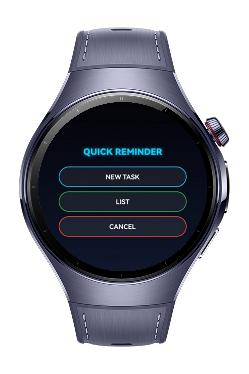
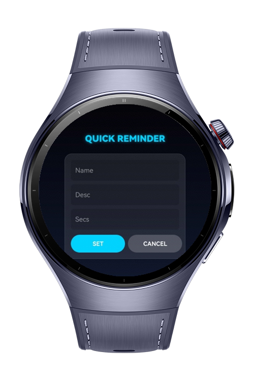

# QuickReminder

**QuickReminder** is a lightweight reminder application designed specifically for HarmonyOS-based wearable devices. The app allows users to create short-term reminders (in seconds) and receive a notification when the time expires.

This app was built to serve simple, fast scenarios such as reminding users of tasks while their hands are busy (e.g., while eating, cooking, or working). With just a few taps, users can set a quick alert directly from their wrist.

# Preview

<div>
  
  
</div>

# Use Cases

* **Timer-Based Reminder System**: Quickly set reminders with a title, content, and countdown in seconds.
* **System Notification Integration**: Triggers high-priority system notifications using the `reminderAgentManager`.
* **Haptic Feedback**: Integrated vibration support to provide physical confirmation when a reminder is set.
* **Minimalist Wearable UI**: A clean, small-screen optimized interface with dynamic form visibility and smooth ArkUI transitions.
* **Task Management**: Ability to query active reminders and cancel existing ones easily.

# Technology

## Stack
- **Languages**: ArkTS, ArkUI
- **Frameworks**: HarmonyOS SDK 5.0.2(14)
- **Tools**: DevEco Studio Version 5.1.0.828
- **Libraries**:
* **`@kit.ArkUI`**: For building responsive wearable interfaces and custom UI components.
* **`@kit.BackgroundTasksKit`**: Utilizes `reminderAgentManager` for persistent background scheduling.
* **`@kit.NotificationKit`**: Manages notification permissions and communication slots.
* **`@kit.AbilityKit`**: Handles UIAbility context and application lifecycle.
* **`@kit.SensorServiceKit`**: Powers the `vibrator` service for tactile user feedback.

## Required Permissions
| Permission | Description |
| :--- | :--- |
| `ohos.permission.KEEP_BACKGROUND_RUNNING` | Allows the reminder service to persist in the background. |
| `ohos.permission.PUBLISH_AGENT_REMINDER` | Grants authority to publish agent-based reminders to the system. |
| `ohos.permission.VIBRATE` | Enables haptic feedback during user interactions. |

# Directory Structure

``` 
QuickReminder
|--- entry/src/main/ets/
| |--- entryability/
| | |--- EntryAbility.ets      # App lifecycle and initialization
| |--- common/
| | |--- utils/
| | | |--- Logger.ets          # Standardized logging utility
| | | |--- ReminderService.ets # Core logic for reminders and haptics
| |--- viewmodel/
| | |--- ReminderViewModel.ets # MVVM logic and state management
| |--- view/
| | |--- MenuButton.ets        # Custom Component: Interactive buttons
| | |--- CompactInput.ets      # Custom Component: Small-screen inputs
| |--- pages/
| | |--- Index.ets             # Main application entry page
| |--- resources/              # Media, strings, and color resources
```

# Constraints and Restrictions
## Supported Device

* Huawei Watch 5

# License

**QuickReminder** is distributed under the terms of the MIT License
See the [LICENSE](./LICENSE) for more information.