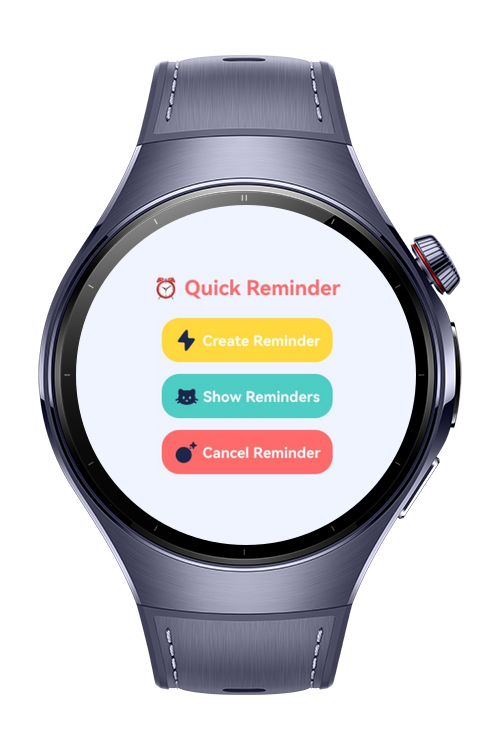
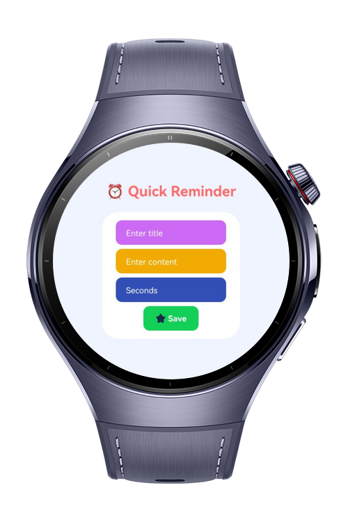

> **Note:** To access all shared projects, get information about environment setup, and view other guides, please visit [Explore-In-HMOS-Wearable Index](https://github.com/Explore-In-HMOS-Wearable/hmos-index).

# QuickReminder

**QuickReminder** is a lightweight reminder application designed specifically for HarmonyOS-based wearable devices. The app allows users to create short-term reminders (in seconds) and receive a notification when the time expires.

This app was built to serve simple, fast scenarios such as reminding users of tasks while their hands are busy (e.g., while eating, cooking, or working). With just a few taps, users can set a quick alert directly from their wrist.

# Preview

<div>
  
  
</div>

# Use Cases

- **Timer-Based Reminder System**: Enter a title, content, and countdown time.
- **Notification Integration**: Triggers a system notification when the timer expires.
- **Minimalist UI**: Small-screen friendly interface with dynamic form visibility.

# Technology

## Stack
- **Languages**: ArkTS, ArkUI
- **Frameworks**: HarmonyOS SDK 5.0.2(14)
- **Tools**: DevEco Studio Version 5.1.0.828
- **Libraries**:
  - `@kit.ArkUI`
  - `@kit.BackgroundTasksKit`
  - `@kit.BasicServicesKit`
  - `@kit.NotificationKit`
  - `@kit.AbilityKit`

## Required Permissions
- `ohos.permission.KEEP_BACKGROUND_RUNNING`
  > Allows the app to continue running tasks in the background.
- `ohos.permission.PUBLISH_AGENT_REMINDER`
  > Allows the app to create and publish reminder notifications.
  

# Directory Structure

``` 
QuickReminder
|--- entry/src/main/ets/
| |--- common/
| | |--- utils/
| | | |--- Logger.ets
| |
| |--- pages/
| | |--- Index.ets
| |
| |--- resources/
| |--- screenshots/
```

# Constraints and Restrictions
## Supported Device

* Huawei Watch 5

# License

**QuickReminder** is distributed under the terms of the MIT License
See the [LICENSE](./LICENSE) for more information.